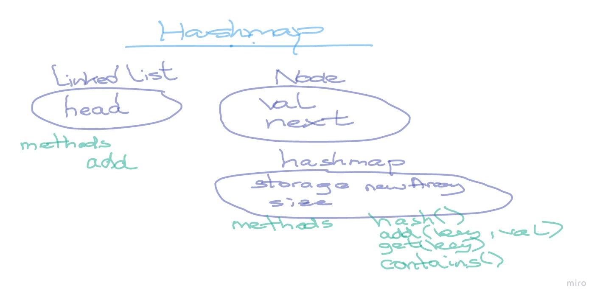

# Hashtables

<!-- Short summary or background information -->

## Challenge

### Features

Implement a Hashtable with the following methods:

- add: takes in both the key and value. This method should hash the key, and add the key and value pair to the table, handling collisions as needed.
- get: takes in the key and returns the value from the table.
- contains: takes in the key and returns a boolean, indicating if the key exists in the table already.
- hash: takes in an arbitrary key and returns an index in the collection.

## Approach & Efficiency

hashtables (because they are array like structures have a Big O: Time O(1) in best case scenario (only one entry at hash position))

adding a linked list at every position of the hash array when we first store data there (key, value pair - as an array of 2 values)

## Links

- [Link to PR](https://github.com/fizzo999/data-structures-and-algorithms/pull/35)
- [Link to code - hashtable.js](./hashtable.js)
- [Link to test - hashtable.test.js](./__tests__/hashtable.test.js)
- [Link to PR on github ](./__tests__/hashtable.test.js)

### UML Hashtable

### Implementation

Provide a visual step through for each of the sample arrays based on the provided pseudo code
Convert the pseudo-code into working code in your language
Present a complete set of working tests

## Approach & Efficiency

1. TIME: O(1) - best case scenario.
1. SPACE: O(n)

## Resources

- [Canvas CF Hashs tables](https://codefellows.github.io/common_curriculum/data_structures_and_algorithms/Code_401/class-30/resources/Hashtables.html)
- [tutorialspoint](https://www.tutorialspoint.com/Hash-Table-Data-Structure-in-Javascript)
- [educative](https://www.educative.io/blog/data-strucutres-hash-table-javascript)

* [x] Top-level README “Table of Contents” is updated
* [x] Feature tasks for this challenge are completed
* [x] Unit tests written and passing
  - [x] “Happy Path” - Expected outcome
  - [x] Expected failure
  - [x] Edge Case (if applicable/obvious)
* [x] README for this challenge is complete
  - [x] Summary, Description, Approach & Efficiency, Solution
  - [x] Link to code
  - [x] Picture of whiteboard
