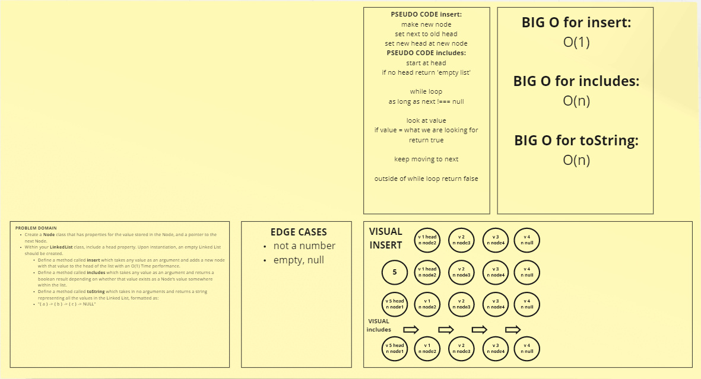

# Challenge Summary

<!-- Short summary or background information -->

## Challenge Description

- Create a Node class that has properties for the value stored in the Node, and a pointer to the next Node.
- Within your LinkedList class, include a head property. Upon instantiation, an empty Linked List should be created.
- Define a method called insert which takes any value as an argument and adds a new node with that value to the head of the list with an O(1) Time performance.
- Define a method called includes which takes any value as an argument and returns a boolean result depending on whether that value exists as a Node’s value somewhere within the list.
- Define a method called toString (or **str** in Python) which takes in no arguments and returns a string representing all the values in the Linked List, formatted as:
  "{ a } -> { b } -> { c } -> NULL"

## Approach & Efficiency

1. insert: O(1).
1. includes: O(n).
1. toString: O(n).

## Solution

