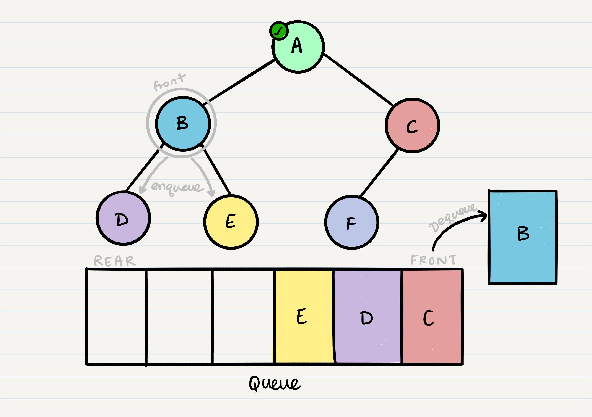

# Binary Trees and Binary Search Trees

binary search tree challenge

## Challenge

add methods of addNode(value) and contains(value) to class Binary Tree
add a new class of BinarySearchTree and add methods to create new binary search trees, search the tree and return the values in the tree based on post order, in order and pre order methodology.

### Approach & Efficiency

pre in and post order we went through in class - addNode and contains I had to research

### API

- addNode() - takes in a value and adds a new node to the tree
- contains() - takes in a value and searches the tree. Returns true if found and false if not found.

- findMaxValue() - searches the tree for the maximum value in it.

- preOrder() - sorts the values in the tree based on data, left, right method and returns an array of all values in the tree.
- inOrder() - sorts the values in the tree based on left, data, right method and returns in order an array of all values in the tree.
- postOrder() - sorts the values in the tree based on left, right, data method and returns an array of all values in the tree.

- breadthFirstTraversal() - returns an array with the node values sorted in the breadth first traversal method
  

### Testing

- Can successfully instantiate an empty tree
- Can successfully instantiate a tree with a single root node
- Can successfully add a left child and right child to a single root node
- Can successfully return a collection from a preorder traversal
- Can successfully return a collection from an inorder traversal
- Can successfully return a collection from a postorder traversal
- Can successfully return a collection from a breadthFirst traversal

### UML

### Approach & Efficiency - BIG O

Time <-- O(log n)
Space <-- O(n)

## Resources

[https://iq.opengenus.org/binary-tree-in-javascript/](https://iq.opengenus.org/binary-tree-in-javascript/)

- [x] Top-level README “Table of Contents” is updated
- [x] Feature tasks for this challenge are completed
- [x] Unit tests written and passing
  - [x] “Happy Path” - Expected outcome
  - [x] Expected failure
  - [x] Edge Case (if applicable/obvious)
- [x] README for this challenge is complete
  - [x] Summary, Description, Approach & Efficiency, Solution
  - [x] Link to code
  - [x] Picture of whiteboard
