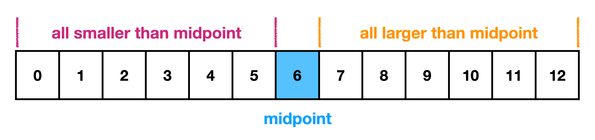

# Challenge Summary

<!-- Short summary or background information -->

## Challenge Description

Write a function called insertShiftArray which takes in an array and the value to be added. Without utilizing any of the built-in methods available to your language, return an array with the new value added at the middle index.

## Approach & Efficiency

1. read the instructions twice
1. make newArray empty
1. find the middle of the input array - when uneven round up
1. loop through the array with a for loop (so you can use index)
1. if index is smaller then the middle take the num of input array and push into new array
1. if index is equal to the middle take the input value and push into new array
1. if index is greater then the middle take the num of input array and push into new array
1. careful with the i index and the old array (gotta go minus 1)

## Solution

### https://skilled.dev/course/binary-search-trees

