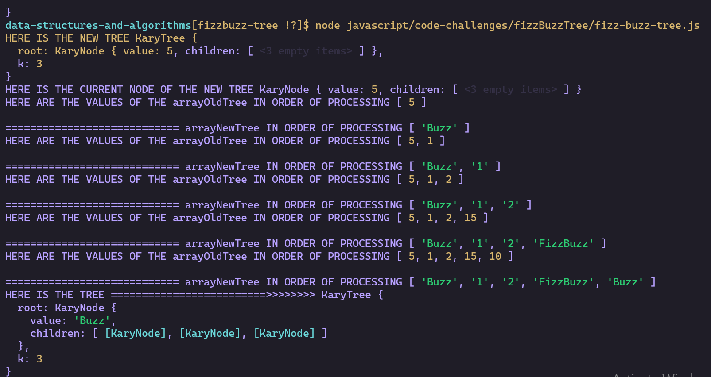

# Challenge Summary

Fizz Buzz K ary Tree conversion

## Challenge Description

#### Feature Tasks

- Write a function called FizzBuzzTree which takes a k-ary tree as an argument.
- Without utilizing any of the built-in methods available to your language, determine whether or not the value of each node is divisible by 3, 5 or both. Create a new tree with the same structure as the original, but the values modified as follows:
- If the value is divisible by 3, replace the value with “Fizz”
- If the value is divisible by 5, replace the value with “Buzz”
- If the value is divisible by 3 and 5, replace the value with “FizzBuzz”
- If the value is not divisible by 3 or 5, simply turn the number into a String.
- Return a new tree.

## Approach & Efficiency

#### O(n) time / O(k) space

1. read the instructions twice
1. create a Node Class
1. create a karyTree Class that takes k as an argument (how many children max at each node)
1. define a current and a newCurrent marker
1. define a queueOldTree and a queueNewTree
1. unshift the currentOld into the queuOld and the currentNew into the queuNew
1. START THE WHILE LOOP (while there is Nodes left in the queue)
1. pop off (takes it from the end of the queue/array) for both Old and newQueue and re assign their NodeObjects to currentOldTree and currentNewTree
1. then check for the value of currentOld for fizz buzz or fizzbuzz and re assign value from old to new (numbers or fizzbuzz)
1. for all the children of the oldtree create new Nodes in the NewTree
1. for all the children of the oldtree - for loop - unshift them to the front of the queue
1. same as for the children of the newTree (just created Nodes) - unshift them to the front of the NewQueue
1. return the tree

## Solution

- [k-ary tree - tutorialspoint](https://www.tutorialspoint.com/k-ary-tree-in-data-structure)
  

- [https://developer.mozilla.org/en-US/docs/Web/JavaScript/Reference/Global_Objects/Array/unshift](https://developer.mozilla.org/en-US/docs/Web/JavaScript/Reference/Global_Objects/Array/unshift)

- [https://developer.mozilla.org/en-US/docs/Web/JavaScript/Reference/Global_Objects/Array/pop](https://developer.mozilla.org/en-US/docs/Web/JavaScript/Reference/Global_Objects/Array/pop)

- 
