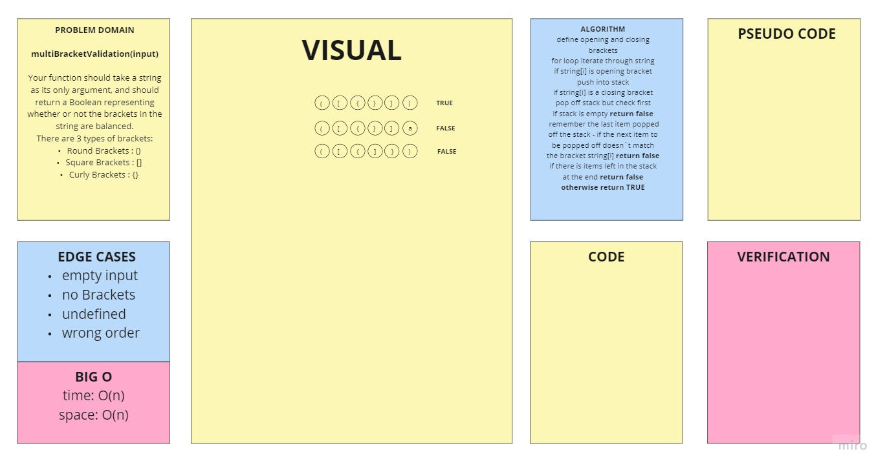

# Merge Sort

## [Link to Blog Post](./BLOG.md)

- [Link to PR](https://github.com/fizzo999/data-structures-and-algorithms/pull/35)
- [Link to code - merge-sort.js](./merge-sort.js)
- [Link to test - merge-sort.test.js](./__test__/merge-sort.test.js)

## Challenge Summary

Review the pseudocode below, then trace the algorithm by stepping through the process with the provided sample array. Document your explanation by creating a blog article that shows the step-by-step output after each iteration through some sort of visual.

Once you are done with your article, code a working, tested implementation of Merge Sort based on the pseudocode provided.

### Pseudo Code:

```

ALGORITHM Mergesort(arr)
    DECLARE n <-- arr.length

    if n > 1
      DECLARE mid <-- n/2
      DECLARE left <-- arr[0...mid]
      DECLARE right <-- arr[mid...n]
      // sort the left side
      Mergesort(left)
      // sort the right side
      Mergesort(right)
      // merge the sorted left and right sides together
      Merge(left, right, arr)

ALGORITHM Merge(left, right, arr)
    DECLARE i <-- 0
    DECLARE j <-- 0
    DECLARE k <-- 0

    while i < left.length && j < right.length
        if left[i] <= right[j]
            arr[k] <-- left[i]
            i <-- i + 1
        else
            arr[k] <-- right[j]
            j <-- j + 1

        k <-- k + 1

    if i = left.length
       set remaining entries in arr to remaining values in right
    else
       set remaining entries in arr to remaining values in left
```

### Sample Arrays

In your blog article, visually show the output of processing this input array:

`[8,4,23,42,16,15]`

For your own understanding, consider also stepping through these inputs:

- Reverse-sorted: `[20,18,12,8,5,-2]`
- Few uniques: `[5,12,7,5,5,7]`
- Nearly-sorted: `[2,3,5,7,13,11]`

### Implementation

Provide a visual step through for each of the sample arrays based on the provided pseudo code
Convert the pseudo-code into working code in your language
Present a complete set of working tests

## Approach & Efficiency

1. TIME: O(nLogn).
1. SPACE: O(n).

## Solution

<!--  -->

## Resources

- [Code Fellows Blog example](https://codefellows.github.io/common_curriculum/data_structures_and_algorithms/Code_401/class-26/solutions/BLOG)
- [Geeks for geeks](https://www.geeksforgeeks.org/merge-sort/)

* [x] Top-level README “Table of Contents” is updated
* [x] Feature tasks for this challenge are completed
* [x] Unit tests written and passing
  - [x] “Happy Path” - Expected outcome
  - [x] Expected failure
  - [x] Edge Case (if applicable/obvious)
* [x] README for this challenge is complete
  - [x] Summary, Description, Approach & Efficiency, Solution
  - [x] Link to code
  - [ ] Picture of whiteboard
