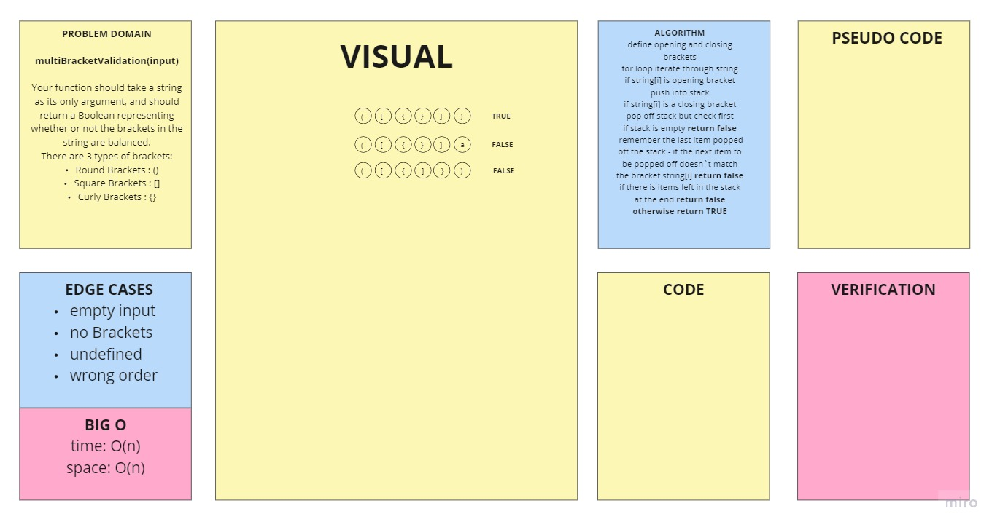

# Challenge Summary

On your main file, create a function called multiBracketValidation(input)

## Challenge Description

Your function should take a string as its only argument, and should return a boolean representing whether or not the brackets in the string are balanced. There are 3 types of brackets:

Round Brackets : ()
Square Brackets : []
Curly Brackets : {}
Example

| Input                   | Output |
| ----------------------- | ------ |
| {}                      | TRUE   |
| {}(){}                  | TRUE   |
| ()[[Extra Characters]]  | TRUE   |
| (){}[[]]                | TRUE   |
| {}{Code}[Fellows](<()>) | TRUE   |
| [({}]                   | FALSE  |
| (](                     | FALSE  |
| {(})                    | FALSE  |

Consider these small examples and why they fail.

Input Output Why
{ FALSE error unmatched opening { remaining.
) FALSE error closing ) arrived without corresponding opening.
[} FALSE error closing }. Doesn’t match opening (.

## Approach & Efficiency

1. SPACE: O(n).
1. TIME: O(n).

## Solution

## Resources

[https://codereview.stackexchange.com/questions/147259/validate-that-brackets-are-balanced](https://codereview.stackexchange.com/questions/147259/validate-that-brackets-are-balanced)

- [x] Top-level README “Table of Contents” is updated
- [x] Feature tasks for this challenge are completed
- [x] Unit tests written and passing
  - [x] “Happy Path” - Expected outcome
  - [x] Expected failure
  - [x] Edge Case (if applicable/obvious)
- [x] README for this challenge is complete
  - [x] Summary, Description, Approach & Efficiency, Solution
  - [x] Link to code
  - [x] Picture of whiteboard
