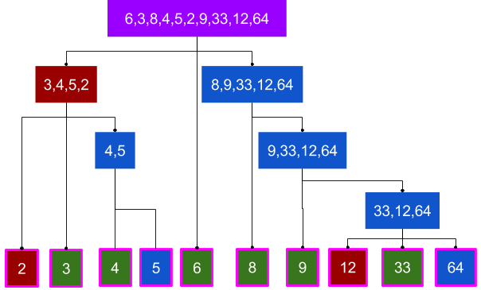

# QuickSort

Quick Sort is a programming algorithm to sort an array. It is known as a divide and conquer method in that you take an array and split it. In the following pseudocode we start the algorithm with an array, the leftmost value of the array, and the rightmost value of the array. This method is recursive, and alters the array in place.

See the following pseudocode for an example of how this algorithm works.

### Pseudo Code

```JavaScript
ALGORITHM QuickSort(arr, left, right)
    if left < right
        // Partition the array by setting the position of the pivot value
        DEFINE position <-- Partition(arr, left, right)
        // Sort the left
        QuickSort(arr, left, position - 1)
        // Sort the right
        QuickSort(arr, position + 1, right)

ALGORITHM Partition(arr, left, right)
    // set a pivot value as a point of reference
    DEFINE pivot <-- arr[right]
    // create a variable to track the largest index of numbers lower than the defined pivot
    DEFINE low <-- left - 1
    for i <- left to right do
        if arr[i] <= pivot
            low++
            Swap(arr, i, low)

     // place the value of the pivot location in the middle.
     // all numbers smaller than the pivot are on the left, larger on the right.
     Swap(arr, right, low + 1)
    // return the pivot index point
     return low + 1

ALGORITHM Swap(arr, i, low)
    DEFINE temp;
    temp <-- arr[i]
    arr[i] <-- arr[low]
    arr[low] <-- temp
```

The power of quick sort comes into play with the partition helper function. This function starts by picking an item as the pivot item, and compares all items against it. This function creates a temporary left and right value, and while the left value is less than the right value check the values and see if you need to swap them one way or the other. This comes into play with the if(arr[i] <= pivot) conditional check. If they need to be swapped, the values are then passed into the swap helper function. At the end of the sorting process, the pivot value is placed in the appropriate position in relation to the left and right values that it was just sorted against.

## visual walk through

Quicksort uses recursion, divide-and-conquer and comparison-sort. It works by partitioning an array into two sub-arrays and then recursively sorting those arrays independently. To make it clear, let’s put this in 3 main steps:

- Choose the pivot (reference value).
- Divide the rest of the array in two, placing everything smaller than the pivot on the left and greater than the pivot on the right.
- Recursively apply the previous steps to the sub-arrays if they have more than 1 element.

In the following chart you can see our example algorithm in action; pivots are green, left arrays are red, and right ones are blue.



### Sample Arrays

In your blog article, visually show the output of processing this input array:

- Input: [6,3,8,4,5,2,9,33,12,64]
- Output: [2,3,4,5,6,8,9,12,33,64]

For your own understanding, consider also stepping through these inputs:

- Reverse-sorted: [20,18,12,8,5,-2]
- Few uniques: [5,12,7,5,5,7]
- Nearly-sorted: [2,3,5,7,13,11]

### Big O

Time Complexity

- Ω(N log N) - best case
- Θ(N log N) - average case
- O(N2) - worst case

### Links and Sources

[https://www.educba.com/quick-sort-in-javascript/](https://www.educba.com/quick-sort-in-javascript/)

[https://medium.com/cesars-tech-insights/quicksort-17c5d24e7e5f](https://medium.com/cesars-tech-insights/quicksort-17c5d24e7e5f)
